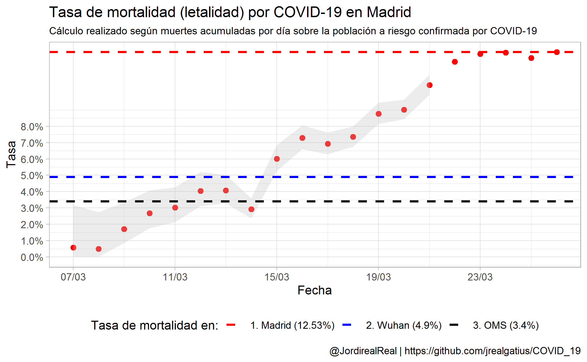
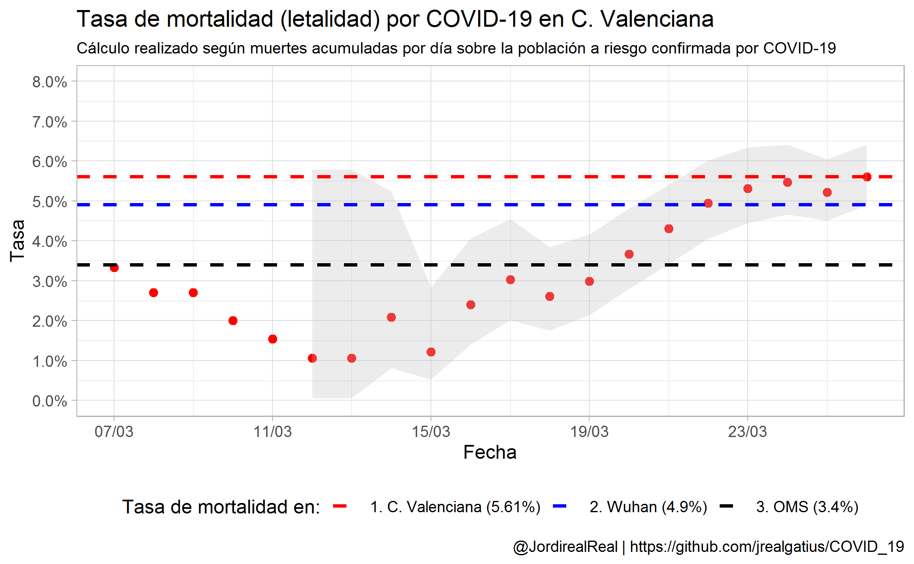
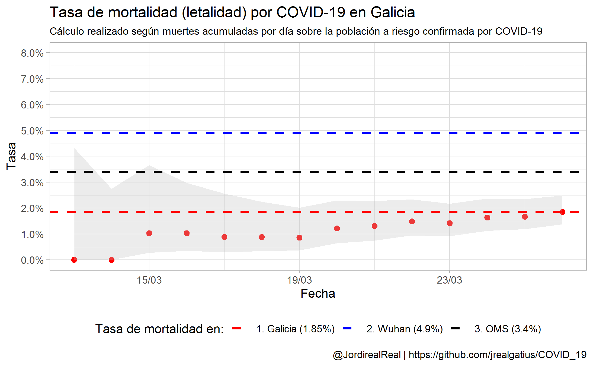
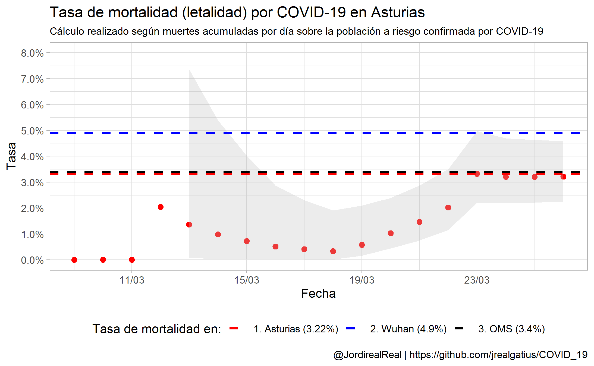
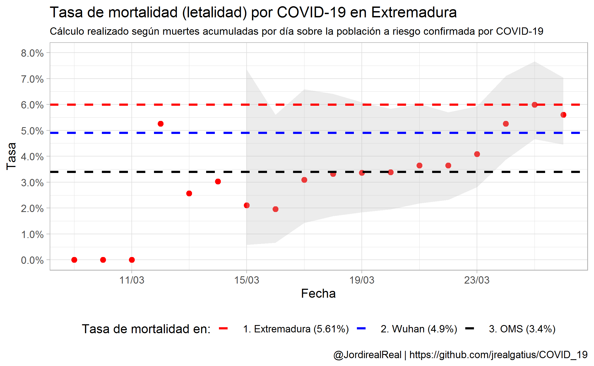
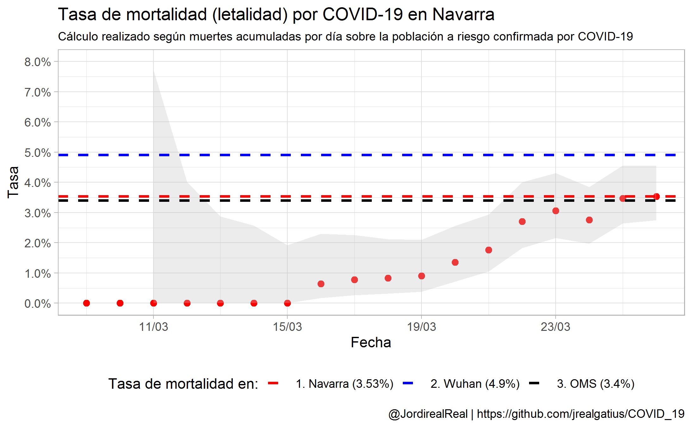

# COVID_19
Coronavirus (COVID-19) Mortality Rate

## 1. Objectius

Evaluar l'evolució de l'estimació de la taxa de mortalitat (letalitat) en casos confirmats de COVID-19 a Espanya

## 2. Mètode

- Dades diaries de casos confirmats de COVID-19 i mortalitat acumulada diaria per Comunitats autònomes
- Font: Repositori de Joe Brew actualitzat amb dades del ministeri
- S'inicia la sèrie fins que no han passat 7 dies per tenir casos potencials de mortalitat.
- No s'han considerat retards per al càlcul. O sigui la població a risc és la població acumulada contagiada en cada moment que es fa el càlcul. 
- Anàlisis descriptiva gràfica de la evoluació de la actualització de la taxa de mortalitat. 
- S'ha inclós una banda de confiança al 95% segons el mètode exacte de la binomial. 
- Es presenten figures de l'evolució diaria globalment i per comunitat autònoma

## 3. Referències

https://www.worldometers.info/coronavirus/coronavirus-death-rate/ 

https://smw.ch/article/doi/smw.2020.20203

## 4. Resultats 

### Globals

### Per comunitats

### Comparativa Madrid la resta d'Espanya

